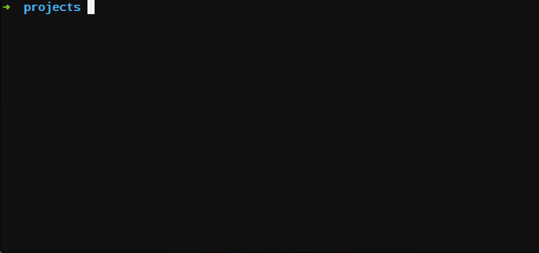

Phoenix-cli
=================

Phoenix Pretty CLI
Use Phoenix Framework with the same friendly rails interface



## Setup

1. Install `gem install phoenix-cli`.

## Getting Started

Install Phoenix at the command prompt if you haven't yet:

```bash
$ phoenix install
```

At the command prompt, create a new Phoenix application:

```bash
$ phoenix new myapp
```

where "myapp" is the application name.


Install the phoenix dependencies

```bash
$ phoenix deps
```

Change directory to myapp and start the web server:

```bash
$ cd myapp
$ phoenix server
```

Run `phoenix` for more options


## Development

When hacking on this gem, the REPL `pry` comes in handy. You can load the
contents of the gem with `pry --gem`.

To test the CLI, run

    ruby -Ilib bin/phoenix-cli


## License

Phoenix CLI is released under the [MIT License](http://www.opensource.org/licenses/MIT).
