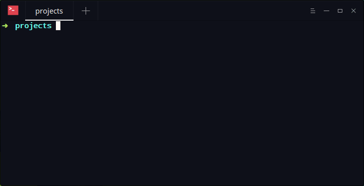

Phoenix-cli
=================
[](https://badge.fury.io/rb/phoenix-cli)
[](https://rubygems.org/gems/phoenix-cli)

Phoenix Pretty CLI
Use Phoenix Framework with the same friendly rails interface



## Setup

1. Install via rubygems

```bash
gem install phoenix-cli
```

## Command List

| Command | Description | Phoenix equivalent |
| --- | --- | --- |
| install | Install Phoenix Framework | -
| new APP_PATH | Create new Phoenix application | mix phoenix.new
| deps | Install the Phoenix dependencies | mix deps.get
| server | Start the web server | mix phoenix.server
| console | Start Phoenix console | iex -S mix
| routes | Show Phoenix routes | mix phoenix.routes
| version | Get current CLI version | -


Run `phoenix` for more options


## Generators List
2. You can use generators with the following syntax

```bash
phoenix generate GENERATOR_NAME
```

| Command | Description | Phoenix equivalent |
| --- | --- | --- |
| scaffold | Generate Full set of model, view, database migration for that model, controller | mix phoenix.gen.html
| api | Generate Full model, view in json, database migration for that model, controller  | mix phoenix.gen.json
| json | Alias for api command  | mix phoenix.gen.json
| model | Generates an Ecto model in your Phoenix application. | mix phoenix.gen.model
| channel | Generates a Phoenix channel  | mix phoenix.gen.channel
| presence | Generates a Presence tracker for your application | mix phoenix.gen.presence
| secret | Generates a secret and print it to the terminal | mix phoenix.gen.secret

## Database Commands

| Command | Description | Phoenix equivalent |
| --- | --- | --- |
| db:create | Create database | mix ecto.create
| db:migrate | Run database migrations | mix ecto.migrate
| db:drop | Drop database | mix deps.drop
| db:dump | Dumps the current environment’s database | mix ecto.dump

## Development

When hacking on this gem, the REPL `pry` comes in handy. You can load the
contents of the gem with `pry --gem`.

To test the CLI, run

    ruby -Ilib bin/phoenix-cli


## License

Phoenix CLI is released under the [MIT License](http://www.opensource.org/licenses/MIT).
